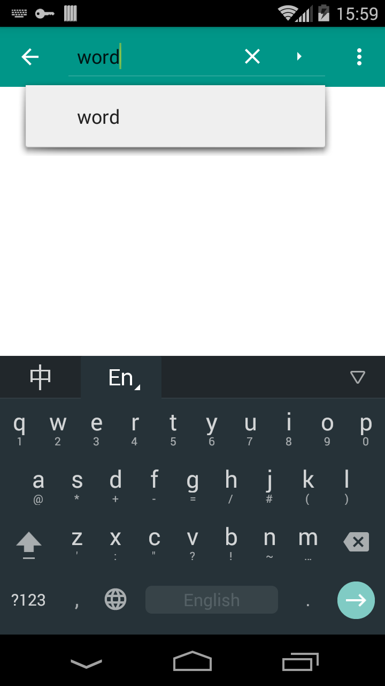
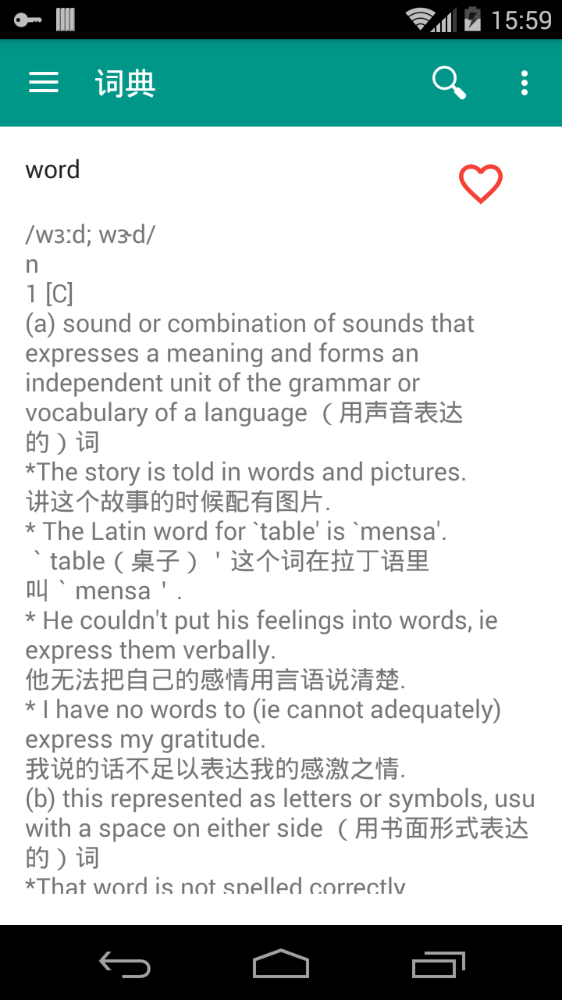
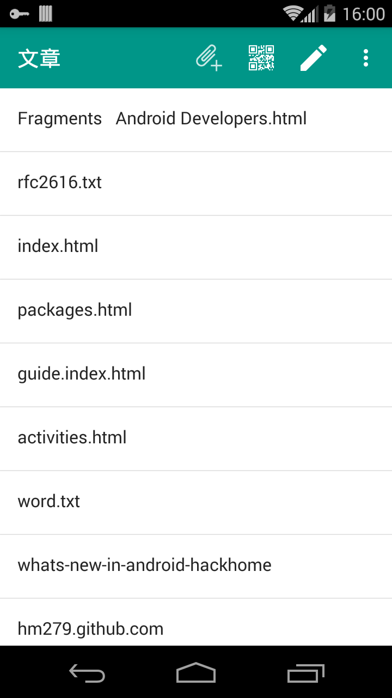
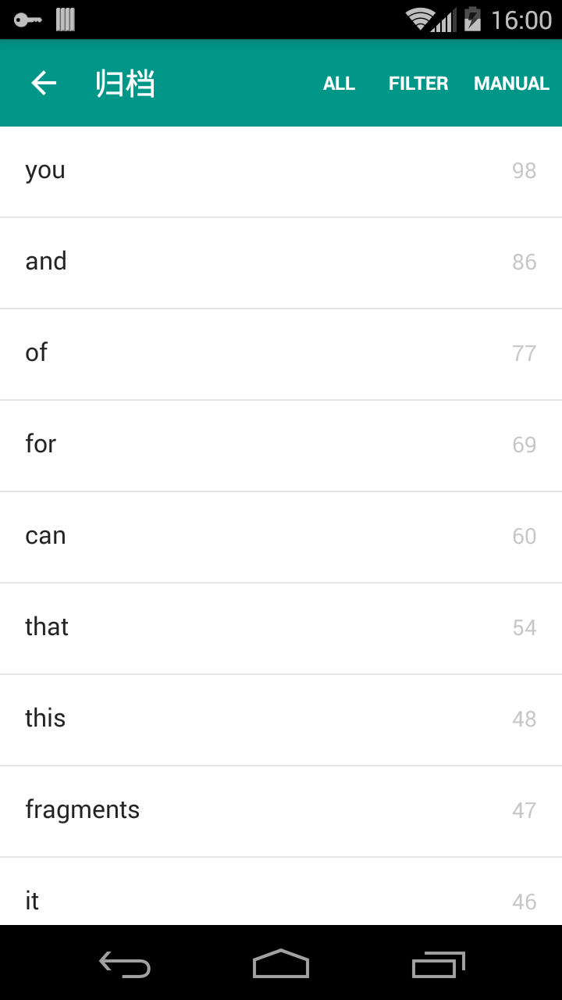

# 字典(Dictionary)
初始想法是让你在阅读英文文章前可以综合认识这篇文章的生词。
后续应该挖掘更多关于个人词库管理的想法，更科学的管理。knowing new words day by day.

## 基本功能(Basic function)
查单词。
不包含字典，需自己添加。实现了 stardict 2.4.2 格式的字典, 还没增加音频图像的支持。后续增加。

## 字典管理
添加字典。

## 文章管理(Paper Manager)
你可以添加 text，html 格式的文章，解析器会分析出单词，统计各个单词的出现次数，按次数排序存储。提供三种方法归档文章单词，归档即是把单词存放到你的单词库里。
- 全部归档，把全部单词归档。
- 过滤归档，把已存在词库里面的单词过滤掉，剩下生词。
- 手动归档，手动选择归档单词。

## 文章查看(Paper Viewer)
文章生词查看

## 个人词典(Personal Dictionary)
对每个单词可以添加个人的解释。
- 根据时间轴显示个人词典，词典记录初始归档时间，同时会记录单词的总统计出现次数，能达到最大出现次的必然是必记单词。
- 根据统计次数显示个人词典。

---

