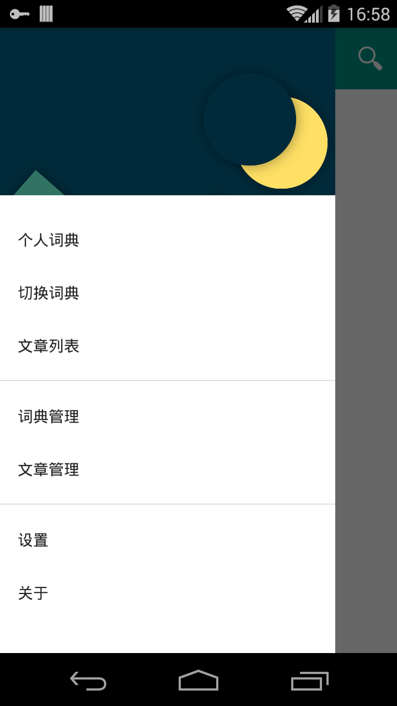

# 想法
问题：

在你英语阅读能力不足前，是时常需要查阅单词的，但当你中断阅读后，你又容易忘记之前看的内容了。

解决方案：

**解析你所需要阅读的英文文章，基于你的单词词库过滤出文章内的生词，集中显示生词解释**

*基础：* 个人单词库

*难题：* 解析文章，Text性质的文档解析容易，其他的格式看OCR。对非 text 数据则通过云端提供的 OCR 服务解析。

- 情景一：还记得当年做阅读理解的痛苦吗？如果拍照下阅读理解的内容进而解析过滤出生词，便可快速查阅生词意思。
- 情景二：浏览器提供插件，解析当前网页内容，根据个人词库过滤出生词，也可快速查阅生词意思。

*核心：* 个人词库（分通用与专业）。

*终极形态：* 得到每个用户的专业性词库数据，提供用户可能感兴趣的单词。

*云端同步个人词库*

以上是基于一个词典应用，你想得到生词的什么解释就看你拥有怎样的词典，不限于英英，英汉，英日，英韩等等，都是针对英语，英语容易分词。

Android 通过 Intent 提供接口，接收 text 数据，解析内容过滤出生词。但这里面没统一格式，怎么实现？

下面是我的部分实现 (Android 应用)

---------------

[下载](app/app-release.apk)

## 基本功能
词典功能。
不包含词典，需自己添加。实现了 stardict 2.4.2 格式的字典, 还没增加音频图像的支持。后续增加字典格式。
一词典 = 一张FTS表一张索引表一项词典信息记录。（还是所有单词一张FTS表?)

FTS 表提高搜索速度，会建立大量索引，空间使用量大增。不存放非搜索数据。
全文搜索表(FTS)：

| rowid      | word     |
| :--------- | --------:|

根据不同词典格式建立不同的索引表。
单词索引表：

| rowid     | offset    | size     |
| :-------- | :-------: | -------: |

记录词典信息表： 

| rowid | name  | type  | data  | active    | table_name  |
| :---- | :----:| :---: | :---: | :-------: | ----------: |

name: 词典名
type: 词典格式
data: 词典相关信息，如相关文件路径等，自定义
active: 激活词典。
table_name: 词典对应的表名，目前是 table_name = name

通用个人词库表： 

| rowid | word | count | time |
| :---- | :---:| :----:| ----:|

专业个人词库表： 

| rowid | word  | count | time  | explain  |
| :---- | :---: | :---: | :---: | -------: |

word: 词
count: 归档次数
time: 初始归档时间
explain: 说明

## 文章管理
你可以添加 text，html 格式的文章，解析器会分析出单词，统计各个单词的出现次数，按次数排序存储。提供三种方法归档文章单词，归档即是把单词存放到你的单词库里。
- 全部归档，把全部单词归档。 
- 过滤归档，把已存在词库里面的单词归档（只是增加了归档次数），过滤出生词。
- 手动归档，手动选择归档单词。

存储格式 JSON ，Key_Value 形式，单词为 key ，次数为 value 。

## 个人词库
分两种类型，通用词库和专业词库。专业词库可以添加解释。（未完全完成）
- 词库记录初始归档时间，同时会记录单词的总统计次数。专业词库多一个个人解释项。
- 根据统计次数、归档时间展示个人词库。 

## TODO
单词变形纠正（如复数），去掉非单词，添加 OCR 云端解析支持，词库云端同步，浏览器插件支持...
